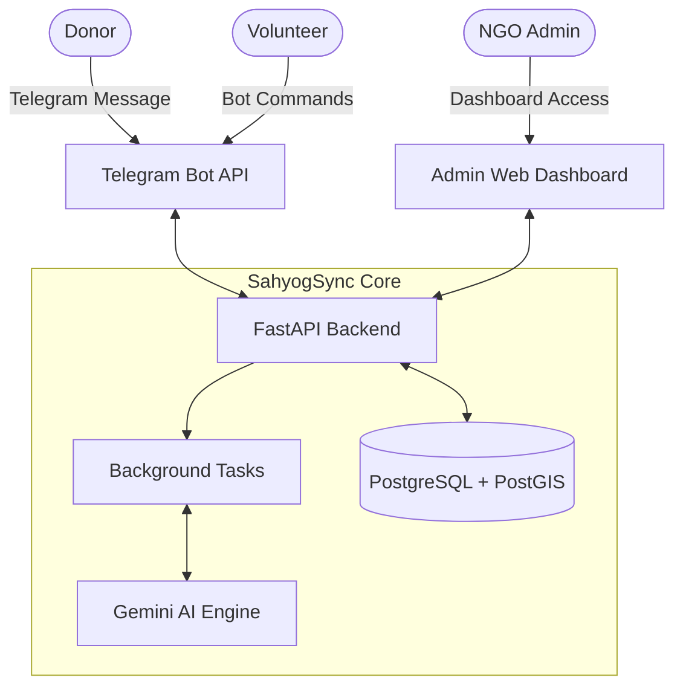

# 🤝 SahyogSync 

> **Where Compassion Meets Computation: The OS for Social Impact.**

In times of crisis or during proactive social campaigns, the biggest bottleneck isn't a lack of resources—it's **fragmented coordination**. SahyogSync is a next-generation **Real-Time Coordination & Intelligence Hub** built to eliminate the gap between urgent field needs and available surplus through AI, asynchronous messaging, and advanced geospatial mapping.

---

## 🧠 The SahyogSync Advantage: Smart & Data-Driven

SahyogSync doesn't just passively record data; it actively interprets and acts on it to make NGO operations hyper-efficient:

*   **⚡ Smart Resource Allocation (The Marketplace)**: We treat social work like a high-speed logistics network. By tracking real-time inventory and mapping geographical needs using **PostGIS**, SahyogSync instantly connects the dots. It matches a donor's surplus (e.g., extra food, medicines) with an NGO's immediate deficit in the same vicinity, minimizing transit times and eliminating resource wastage.
*   **📊 AI-Driven Data Extraction**: Field volunteers and donors shouldn't waste time navigating complex web forms in low-connectivity zones. With our system, they simply send an unstructured, natural language message on **Telegram** (e.g., *"We have 50 extra food packets at Station Road"*). Our **Gemini AI Engine** instantly parses this chaotic text, extracts structured data (item, quantity, location, intent), and triggers automated matching workflows.
*   **🎯 Proactive Mission Control**: Moving beyond reactive relief, NGOs get a comprehensive "Mission Control" dashboard. They can launch targeted campaigns, track live impact metrics, and dynamically dispatch verified volunteers based on their skills and real-time proximity.

---

## ✨ Core Features

*   **🤖 AI Data Pipeline**: Automated conversion of unstructured field chatter into structured, actionable database entries via Google Gemini.
*   **📱 Frictionless Field Interface**: Low-bandwidth Telegram Bot ensuring 100% adoption among volunteers and donors without requiring new app downloads.
*   **🗺️ Geospatial Dispatch**: Intelligent, location-based volunteer and resource routing powered by PostgreSQL & PostGIS.
*   **📦 Dynamic Inventory Ledger**: Real-time tracking of pledges vs. actuals to maintain complete transparency across the supply chain.
*   **📧 Automated Alerts**: Instant, event-triggered communications for NGOs and volunteers powered by the Brevo API.

---

## 👥 Platform Capabilities by User Role

SahyogSync is designed to empower every stakeholder in the social impact ecosystem. Here is how the system serves each persona:

### 1. For Volunteers & Donors (The Field Force)
*   **Telegram-First Reporting**: Send a quick text about surplus supplies or emergency requirements via the Telegram Bot. No apps to install or portals to navigate.
*   **Real-Time Alerts**: Receive immediate notifications when an NGO in your vicinity needs your specific skills or resources.
*   **Task Acceptance & Updates**: Acknowledge dispatch requests, share live updates, and report task completion directly from the chat interface.

### 2. For NGOs (The Mission Controllers)
*   **Centralized Mission Control**: A dedicated web dashboard to view live maps of available resources, volunteer locations, and active crises.
*   **Campaign Management**: Proactively create and manage relief campaigns, set volunteer requirements, and track the progress of ongoing operations.
*   **Automated Dispatch**: The system automatically suggests the best-fit volunteers based on proximity and skill set, allowing NGOs to dispatch teams with a single click.
*   **Inventory Ledger**: Track every pledged item until it is successfully delivered to ensure zero wastage.

### 3. For Central Admins (The System Overseers)
*   **NGO Onboarding & Verification**: Approve and verify NGOs joining the platform to maintain a trusted ecosystem.
*   **Platform Analytics**: Monitor overall platform health, user engagement, and impact metrics across all active campaigns and regions.
*   **System Configuration**: Manage core integrations (Gemini, Telegram, Email services) and maintain the AI workflow logic.

---

## 🏗️ Architecture Overview



---

## 🚀 Quick Start

### 1. Prerequisites
- **Python 3.10+**
- **Docker & Docker Compose** (for spinning up the database locally)

### 2. Database Setup (Postgres + PostGIS)
Spin up the required database container using Docker Compose:
```bash
docker compose up -d
```
*Note: This spins up a fully equipped database with PostGIS enabled, ready for spatial queries and location mapping.*

### 3. Environment Configuration
Create your `.env` file from the template:
```bash
cp .env.example .env
```
*(Edit the `.env` file to add your specific keys—Telegram tokens, Gemini API keys, Brevo credentials, etc. Defaults will match the docker compose setup).*

### 4. Installation
Create a virtual environment and install the dependencies:

```bash
# Create Virtual Environment
python -m venv venv

# Windows Activation:
venv\Scripts\activate

# Linux/Mac Activation:
source venv/bin/activate

# Install Dependencies
pip install -r requirements.txt
```

### 5. Seed the Database
Initialize the required placeholder items (e.g., Default NGO profiles, categories) required for registration:
```bash
python app/db_seed.py
```

### 6. Start the Application
Run the FastAPI development server:
```bash
uvicorn app.main:app --reload
```
Once running, you can validate the API by visiting the health check endpoint: `http://localhost:8000/health` or view the interactive API documentation at `http://localhost:8000/docs`.

---

## 📂 Backend Project Structure

```text
backend/app/
├── api/             # FastAPI Endpoints (Webhooks, Campaigns, Marketplace, etc.)
├── services/        # Core Business Logic & External APIs
│   ├── ai_service.py       # Gemini AI Integrations
│   ├── telegram_service.py # Telegram Bot Handlers
│   └── email_service.py    # Brevo Mail Actions
├── models.py        # SQLAlchemy DB & PostGIS Models
├── database.py      # DB Connection & Session Management
├── main.py          # FastAPI Application Setup
└── config.py        # Environment & Secrets Management
```

---

## 🔮 Future Roadmap

As noted, SahyogSync is an evolving ecosystem. Our immediate next steps include:
- **WhatsApp Integration**: Expanding our field interface from Telegram to WhatsApp for broader accessibility.
- **Agentic Workflows**: Implementing n8n for autonomous task verification and smart logic routing.
- **Advanced Predictive Analytics**: Forecasting resource shortages based on historical data.
- **Multi-lingual Support**: Allowing field workers to interact with the bot in local and regional languages.

---

## 🛠️ Technology Stack
*   **Backend Framework**: FastAPI (Python)
*   **Database**: PostgreSQL with PostGIS
*   **AI/ML**: Google Gemini API (LLM for text parsing & data extraction)
*   **Integrations**: Telegram Bot API, Brevo API (Email Delivery)
*   **Deployment Environment**: Render

---

<div align="center">

**Built with ❤️ by TEAM BINARY**

*SahyogSync is a continuously evolving ecosystem. This is not the final version—we are constantly iterating, refining, and innovating to build a better tool for social impact. The journey has just begun!*

</div>
