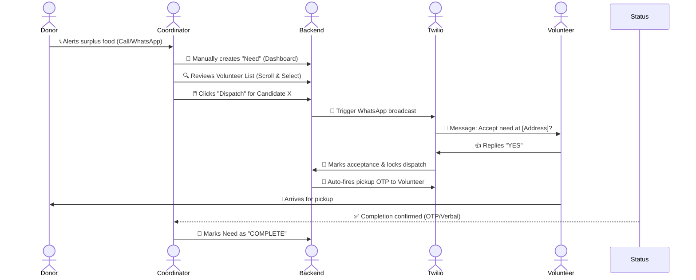
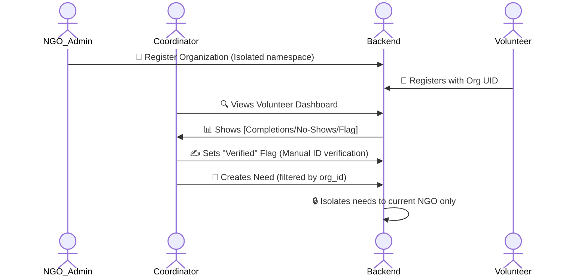
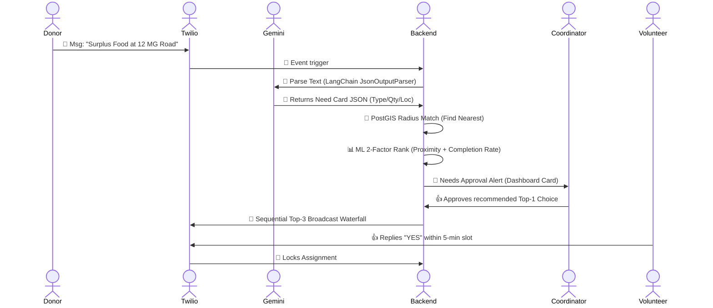
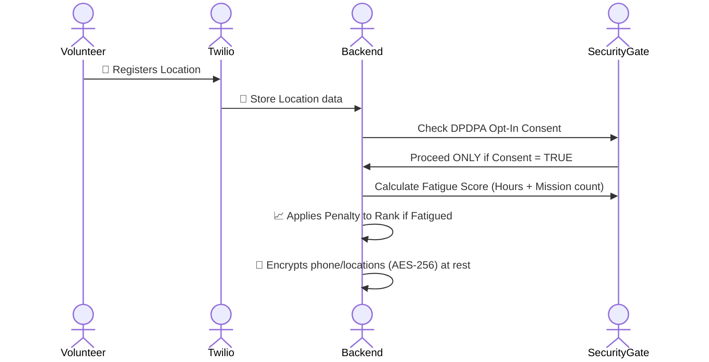
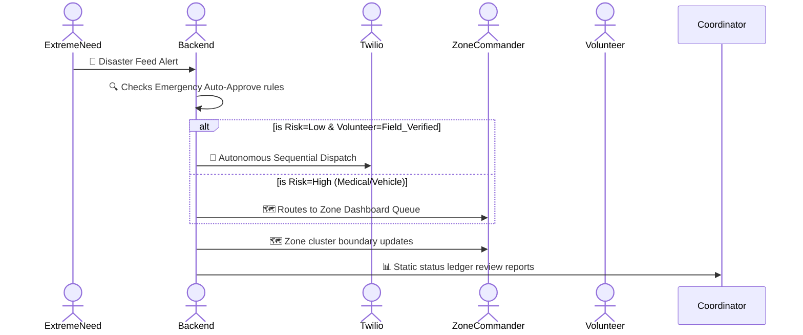

# Sahyog Setu - Complete Operational Lifecycle & Subparts

This document provides a **comprehensive breakdown** of every version of Sahyog Setu, detailing the operational flow (Mermaid diagrams) and the granular subparts/components active in each phase.

---

## 🟢 Version 1.0: The Bridge (Minimum Viable Product)
*Goal: One NGO, basic dashboard, manual dispatch, OTP verification.*

### 🗺️ Operational Flow (Human-In-The-Loop Manual)

### 🧩 Subparts & Components: V1.0
| Subpart | Component | Details |
| :--- | :--- | :--- |
| **NGO Dashboard** | Need Creator | Form: Type, Quantity, Location, Urgency, Pickup deadline. |
| | Volunteer List View | Table row display of registered, active volunteers. |
| **Volunteer System** | Activation Gate | Registration form submits data; strictly sets `whatsapp_active = false` until a reply test message fires to activate the Twilio thread. |
| **Dispatch Intelligence** | Twilio Broadcast | Sequential broadcast trigger on coordinate triggers. |
| **Security Layer** | OTP Engine | HMAC-SHA256 6-digit code generation. 45-min TTL window, single-use, 3-attempt lock constraint. |

---

## 🟡 Version 1.5: Trust & Track (Enhanced Manual)
*Goal: Multi-NGO isolation and basic volunteer accountability data.*

### 🗺️ Operational Flow (Isolated & Accountability Checks)

### 🧩 Subparts & Components: V1.5
| Subpart | Component | Details |
| :--- | :--- | :--- |
| **Multi-NGO Isolation** | Org Scoping | Every query includes `org_id` filtering. Data NEVER crosses NGO boundaries. |
| **Volunteer Trust Flag** | Verified Boolean | Simple checklist verification flag editable by coordinator notes file. |
| **Stats tracking** | Metrics | Tracks `completions_count`, `no_shows_count`, and `last_active_at` on volunteer structure profiles. |
| **Dashboard Analytics** | History Dashboard | Visual lists of average response times per need type. |
| **Resource Tracking** | Simple Quantities | List lookup tracking items: food packets, kits, water canisters. |

---

## 🟠 Version 2.0: Smart Dispatch (AI-Assisted)
*Goal: PostGIS mapping and Gemini NLP parsing to reduce coordinator load.*

### 🗺️ Operational Flow (Automatic Ingestion & Matching)

### 🧩 Subparts & Components: V2.0
| Subpart | Component | Details |
| :--- | :--- | :--- |
| **WhatsApp AI Parser** | Gemini LLM Node | Translates messy text into strict Pydantic JSON tables containing addresses, weights, types. |
| | Low Confidence Queue | Low scores go to `requires_review` dashboard queue for manual fix. |
| **Spatial Matching** | PostGIS GEOMETRY | Spatial query finds candidates within radius in milliseconds; replaces slow app mathematical calculations. |
| **ML Ranking Model** | 2-Factor Ranker | logistic ranking model measuring ` proximity (40%) + completion logic (60%)`. |
| **Dispatch Cascade** | Waterfall Cascade | Sequential Twilio firing loop: Volunteer 1 gets trigger; if dead air, trigger Volunteer 2. |
| **Campaign Mode** | Event slots engine | Structuring events registration, waitlists, morning-of check-ins. |

---

## 🔒 Version 2.5: Hardened Trust (Security Non-Optional)
*Focus: Data privacy compliance (DPDPA 2023) and Volunteer burnout protection.*

### 🗺️ Operational Flow (Pre-Dispatch Compliance Checks)

### 🧩 Subparts & Components: V2.5
| Subpart | Component | Details |
| :--- | :--- | :--- |
| **AES Field Encryption** | At-Rest Protection | Client names, location trace details, phones stored encrypted. |
| **3-Tier Trust system** | Tier pathways | Tier 1: Unverified; Tier 2: ID Verified (Call verification); Tier 3: Field Verified (Office visit logs). |
| **Fatigue Score** | Allocation penalty | Formula `missions_today * 0.12 + hours_last_48 * 0.025`. Penalizes overload risks. |
| **DPDPA 2023 Consent** | Opt-In Gate | Absolute enforcement flag preventing broadcast storage for non-opt-in accounts. |
| **Data Minimization** | Automated Purge | Replaces point coordinate geometry into broad zone grids past 90-day validity filters. |

---

## 🌆 Version 3.0: City Scale (Autonomous Intelligence)
*Focus: Autonomous autopilot safeguards for disaster management, full Impact Score calculation algorithms.*

### 🗺️ Operational Flow (Crisis Auto-approve autopilot)

### 🧩 Subparts & Components: V3.0
| Subpart | Component | Details |
| :--- | :--- | :--- |
| **Zone Deployment dashboard** | Hub Cluster View | Visual segmentation grid separating City triggers vs Sub-Zone priority grids. |
| **Emergency Auto-Approve** | Autopilot Safeguards | Restrictive approval for low risk (Food/Water triggers) solely routing to **Field Verified** candidates. ABSOLUTE EXCLUSION for meds/vehicles. |
| **Full Impact Score Core** | 5-Factor Score | Proximity, Completion, Hours, Latency, Zone. Incorporates temporal decay over 12-month frames. |
| **Right to Reset** | Score Archive | Annual wipe setup Archiving logs to cold tables wiping view tracking algorithms without losing historical reference nodes. |
| **AI Operations Advisor** | Pattern Analyzer | Monthly analytical nodes reviewing zone coverage gaps for resource allocations rather than dispatch assistance. |
