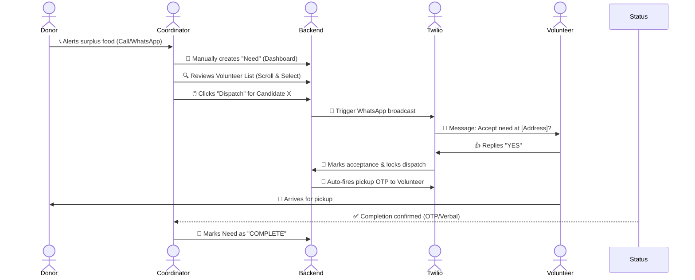
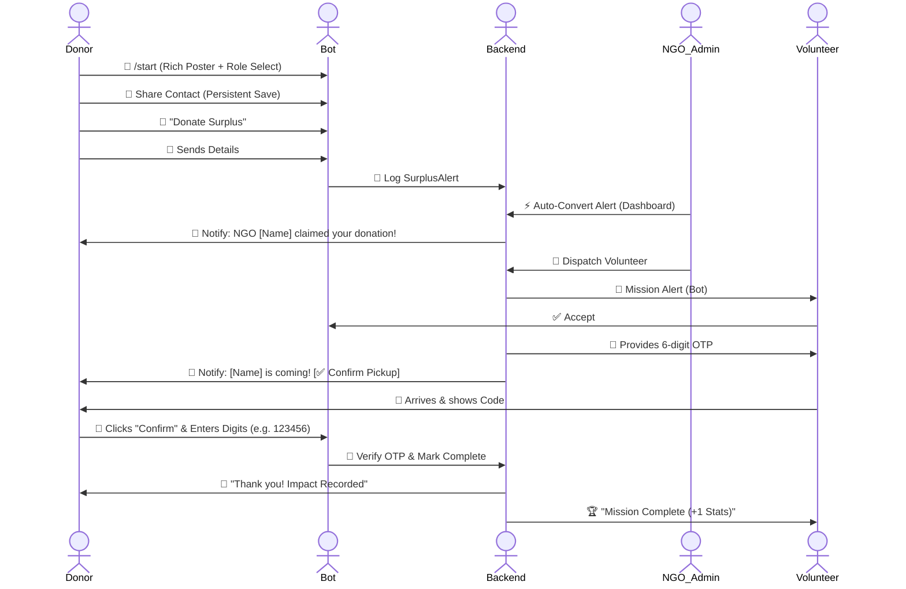
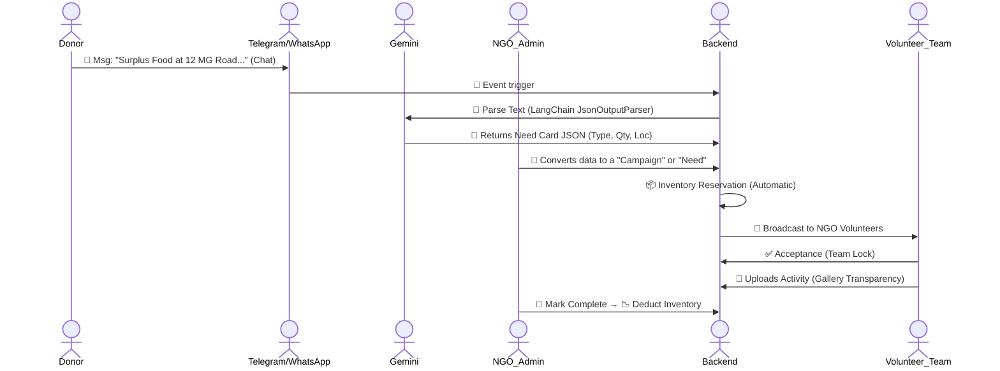
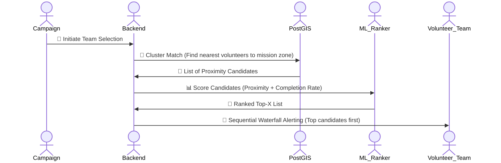
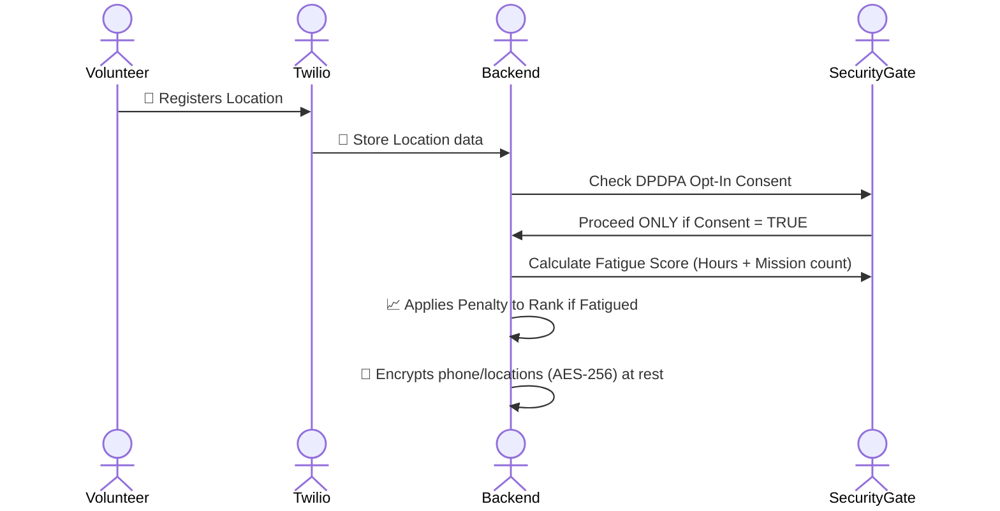
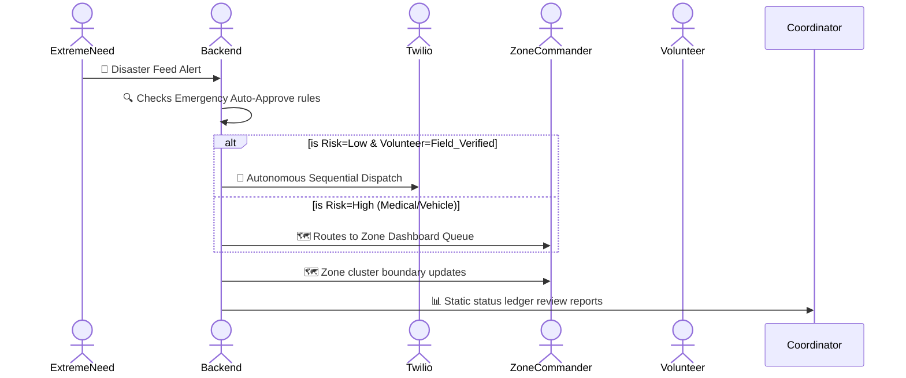

# Sahyog Setu - Complete Operational Lifecycle & Subparts

This document provides a **comprehensive breakdown** of every version of Sahyog Setu, detailing the operational flow (Mermaid diagrams) and the granular subparts/components active in each phase.

> [!IMPORTANT]
> **Migration Note: Twilio to Telegram API (Hackathon Phase)**
>
> For the current hackathon development phase of our project Sahyog Setu, we have decided to shift our messaging integration from Twilio API to the Telegram Bot API.
> 
> This decision has been taken due to practical constraints such as business verification requirements, setup time, and limited access to free-tier messaging services on Twilio/WhatsApp at this early prototype stage.
> 
> **Telegram provides:**
> - Completely free bot and messaging API access
> - Faster development and deployment for real-time communication features
> - Easy user onboarding via bot links and groups
> - Sufficient scalability for demonstrating impact during the hackathon
> 
> Our focus at this stage is to build a functional, high-impact prototype that clearly demonstrates the platform’s value in connecting donors, NGOs, and volunteers efficiently. 
> 
> In the long term, as the project evolves toward a startup model, we plan to evaluate and integrate more enterprise-grade communication solutions (such as WhatsApp Business API or custom mobile applications) based on scalability, compliance, and user adoption requirements.

---

## 🟢 Version 1.0: The Bridge (Minimum Viable Product)
*Goal: One NGO, basic dashboard, manual dispatch, OTP verification.*

### 🗺️ Operational Flow (Human-In-The-Loop Manual)

### 🧩 Subparts & Components: V1.0
| Subpart | Component | Details |
| :--- | :--- | :--- |
| **NGO Dashboard** | Need Creator | Form: Type, Quantity, Location, Urgency, Pickup deadline. |
| | Volunteer List View | Table row display of registered, active volunteers. |
| **Volunteer System** | Telegram Bot Gate | Registration linked via `ACTIVATE <phone>`; sets `telegram_active = true` to enable machine alerts. |
| **Dispatch Intelligence** | Telegram Broadcast | Native Bot API message delivery for mission alerts. |
| **Security Layer** | OTP Engine | HMAC-SHA256 6-digit code generation. 45-min TTL window, single-use, 3-attempt lock constraint. |

---

## 🟡 Version 1.5, 1.6 & 1.7: Trust & Track (Enhanced UX)
*Goal: Multi-NGO isolation, Rich Onboarding, and Smart OTP flow.*

### 🗺️ Operational Flow (Donor-Bot Integration)

### 🧩 Subparts & Components: V1.5/1.6
| Subpart | Component | Details |
| :--- | :--- | :--- |
| **Onboarding** | Rich Role-Select | Visual poster + Inline buttons for Role Discovery. |
| **Marketplace** | Auto-Convert Engine| One-click transform from Alert to linked Need. |
| **Donor Bot** | 🎁 Donate Surplus | Specialized button and persistent contact verification. |
| **Verification** | Smart OTP Detection | Donor clicks "Confirm" and bot auto-verifies 6 digits. |
| **Lifecycle** | ACCEPTED/COMPLETED | Granular state tracking for every mission stage. |
| **Performance** | Persistent Client | Reuse of httpx connections for 3x faster delivery. |
| **Volunteer Trust**| 3-Tier System | `UNVERIFIED` -> `ID_VERIFIED` -> `FIELD_VERIFIED`. |
| **Menu Sync** | Automated Scopes | Bot commands automatically sync based on user role. |

---

---

---

## 🟠 Version 2.0: Mission Foundation & AI Ingestion
*Goal: Automate input via AI and structure internal NGO missions (Campaigns).*

### 🗺️ Operational Flow (AI-to-Campaign Lifecycle)

### 🧩 Subparts & Components: V2.0 (Foundation)
| Subpart | Component | Details |
| :--- | :--- | :--- |
| **AI Ingestion** | Gemini LLM Node | Uses `JsonOutputParser` to translate messy user text into structured Campaign/Need input. |
| **Campaign Engine** | Mission Manager | NGO-isolated mission structure with role definitions and participation slots. |
| **Inventory Sync** | Resource Locking | Automatic reservation logic: "Locks" NGO stock during PLANNING; Deducts upon COMPLETION. |
| **Transparency Layer**| Gallery & Proof-of-Work| Volunteer-bot photo uploads generating real-time mission status updates and trust building. |

---

## 🔵 Version 2.1: Strategic Resource Allocation (Optimization)
*Goal: Intelligent matching using PostGIS spatial queries and ML ranking.*

### 🗺️ Operational Flow (Smart Matching Lifecycle)

### 🧩 Subparts & Components: V2.1 (Intelligence)
| Subpart | Component | Details |
| :--- | :--- | :--- |
| **Spatial Matching** | PostGIS GEOMETRY | Efficient spatial indexing to find candidates or mission zones within milliseconds. |
| **ML Ranking Model** | 2-Factor Ranker | Logistic ranking measuring `proximity (40%) + historical completion rate (60%)` for team selection. |
| **Dispatch Cascade** | Waterfall Alerting | Sequential Telegram firing loop: Alerts Top Tier first; then Tier 2 if slots remain empty. |
| **Impact Analytics** | Mission Impact Core | Calculating NGO efficiency scores based on time-to-complete and resource-to-impact ratios. |

---

## 🔒 Version 2.5: Hardened Trust (Security Non-Optional)
*Focus: Data privacy compliance (DPDPA 2023) and Volunteer burnout protection.*

### 🗺️ Operational Flow (Pre-Dispatch Compliance Checks)

### 🧩 Subparts & Components: V2.5
| Subpart | Component | Details |
| :--- | :--- | :--- |
| **AES Field Encryption** | At-Rest Protection | Client names, location trace details, phones stored encrypted. |
| **Fatigue Score** | Allocation penalty | Formula `missions_today * 0.12 + hours_last_48 * 0.025`. Penalizes overload risks. |
| **DPDPA 2023 Consent** | Opt-In Gate | Absolute enforcement flag preventing broadcast storage for non-opt-in accounts. |
| **Data Minimization** | Automated Purge | Replaces point coordinate geometry into broad zone grids past 90-day validity filters. |

---

## 🌆 Version 3.0: City Scale (Autonomous Intelligence)
*Focus: Autonomous autopilot safeguards for disaster management, full Impact Score calculation algorithms.*

### 🗺️ Operational Flow (Crisis Auto-approve autopilot)

### 🧩 Subparts & Components: V3.0
| Subpart | Component | Details |
| :--- | :--- | :--- |
| **Zone Deployment dashboard** | Hub Cluster View | Visual segmentation grid separating City triggers vs Sub-Zone priority grids. |
| **Emergency Auto-Approve** | Autopilot Safeguards | Restrictive approval for low risk (Food/Water triggers) solely routing to **Field Verified** candidates. ABSOLUTE EXCLUSION for meds/vehicles. |
| **Full Impact Score Core** | 5-Factor Score | Proximity, Completion, Hours, Latency, Zone. Incorporates temporal decay over 12-month frames. |
| **Right to Reset** | Score Archive | Annual wipe setup Archiving logs to cold tables wiping view tracking algorithms without losing historical reference nodes. |
| **AI Operations Advisor** | Pattern Analyzer | Monthly analytical nodes reviewing zone coverage gaps for resource allocations rather than dispatch assistance. |
