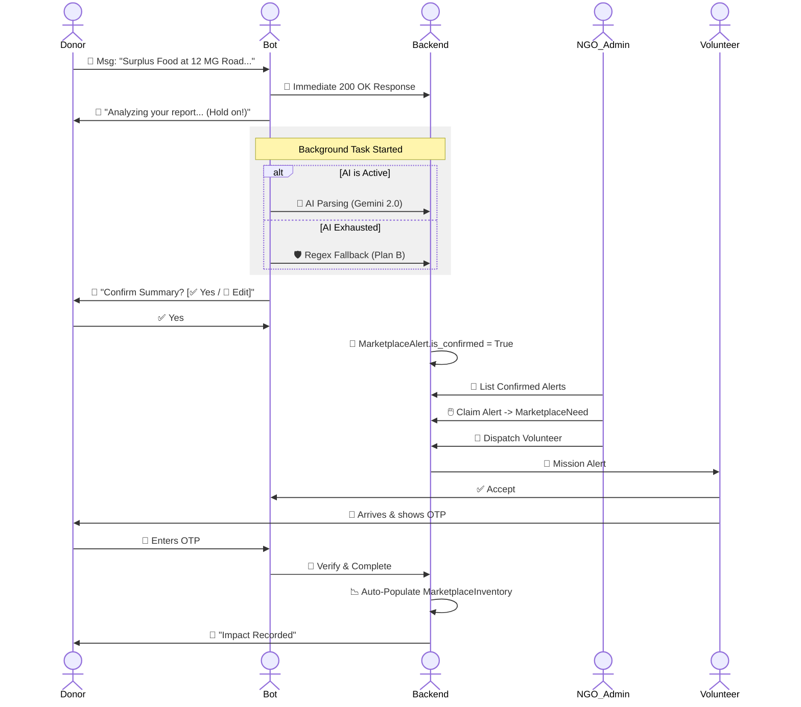
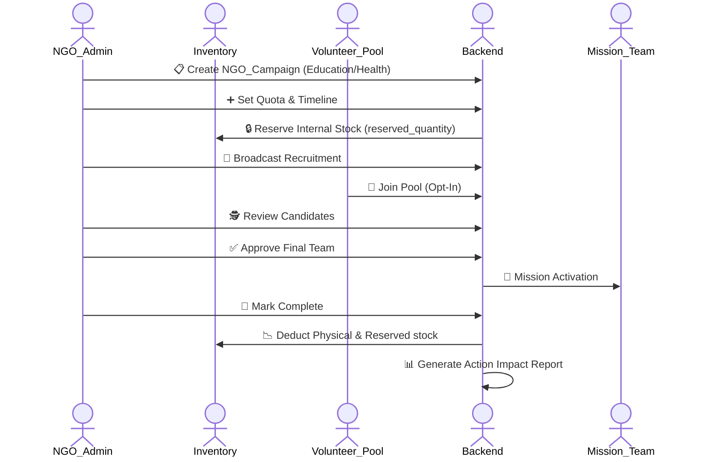
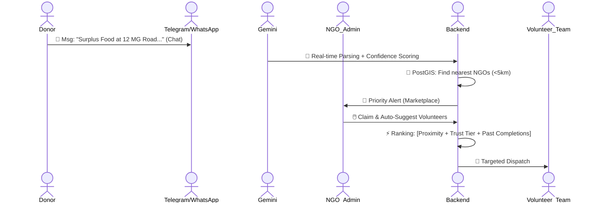

# Sahyog Setu - Complete Operational Lifecycle & Subparts

This document provides a **comprehensive breakdown** of every version of Sahyog Setu, detailing the operational flow (Mermaid diagrams) and the granular subparts/components active in each phase.

---

## 🌐 Version 1.0 - 1.7: The Reactive Bridge
*Goal: Connecting donors to NGOs for instant food recovery.*

### 🗺️ Operational Flow (Marketplace / Speed Layer)

---

## 🏢 Version 2.0: Mission Control (The Action Layer)
*Goal: Structured, team-based NGO campaigns with strict resource security.*

### 🗺️ Operational Flow (NGO Campaigns / Strategic Layer)

### 🧩 Subparts & Components: V2.0 (Dual-Engine Stability)
| Subpart | Component | Details |
| :--- | :--- | :--- |
| **Stability Layer** | BackgroundTasks | FastAPI processing prevents Telegram timeout retries. |
| **Fail-Safe Gate** | Regex Fallback | Ensures 100% mission uptime even if Gemini AI hits limits. |
| **Recovery Engine** | `MarketplaceInventory` | Auto-logs resources recovered via the public marketplace. |
| **Action Engine** | 6-Step Lifecycle | Identify ➡️ Plan ➡️ Gather ➡️ Execute ➡️ Complete ➡️ Report. |
| **Governance** | Admin Gateway | Pool-based recruitment for complex strategic missions. |

---

## 🔵 Version 2.1: Strategic Resource Allocation (Optimization)
*Goal: Intelligent matching using PostGIS spatial queries and ML ranking.*

### 🗺️ Operational Flow (Smart Matching Lifecycle)

---

## 🔵 Version 2.5: Security & Fatigue (The Bridge)
*Goal: Ensuring volunteer safety and data privacy.*

- **Fatigue Scoring**: Monitors volunteer workload to prevent burnout (Score = Hours + Mission count).
- **Security Gate**: Implements AES-256 encryption at rest for sensitive donor/volunteer PII (Phone numbers, precise locations).
- **Compliance Checks**: Automated verification of NGO status before allowing mission broadcasts.

---

## 🔵 Version 3.0: Intelligence & Scale (Crisis Autopilot)
*Goal: Autonomous resource allocation and city-scale crisis management.*

| Subpart | Component | Details |
| :--- | :--- | :--- |
| **Recovery Engine** | Crisis Autopilot | Automated FCFS dispatch for perishables during high-alert zones. |
| **AI Operations Advisor** | Pattern Analyzer | Monthly analytical nodes reviewing zone coverage gaps. |
| **DPDPA Compliance** | PII Purge | Automated 24h cleanup of ephemeral chat logs and precise coordinates. |
| **Governance** | Admin Gateway | High-level orchestration for city-wide resource distribution. |
| **Optimization** | Spatial Clustering | Real-time map of surplus hotspots for strategic planning. |
